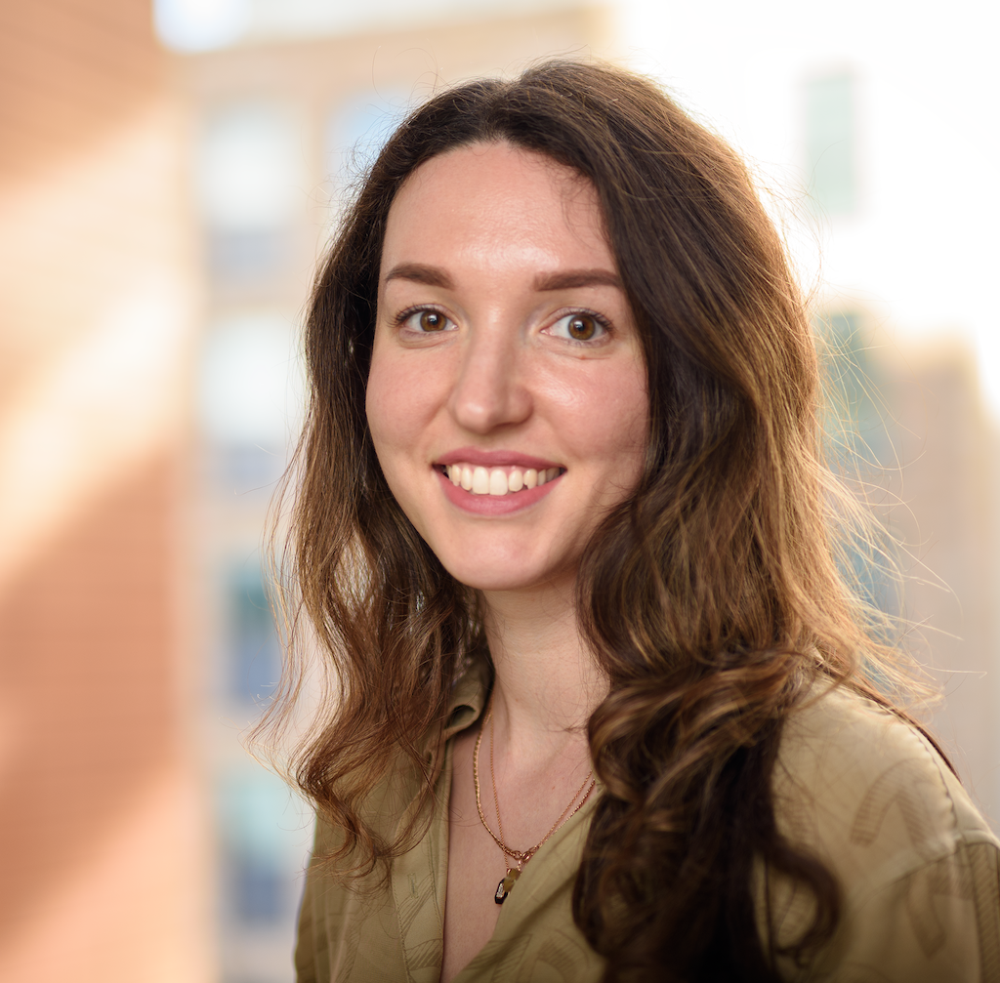

My research is in the fields of machine learning, statistical mechanics and neuroscience. At Imperial College London I lead a research group focused on AI interpretability and robustness. 

Right now, I'm most interested in LLMs for mathematical reasoning, improved model control beyond language, crafting synthetic tasks for understanding the abilities & limits of transformers, and pushing the boundaries on the models ability to connect information in creative ways. 

I also consult on AI deployment for companies, startups and investors. 

## Before
- I was a senior machine learning scientist at Liquid AI [USD250mln raise](https://www.liquid.ai/blog/we-raised-250m-to-scale-capable-and-efficient-general-purpose-ai)
- I co-founded Skialabs, where we built software that manages waste collection operations in cities across the Netherlands, including Amsterdam. Funded by the European Union. 
- Assistant Professor in Machine Learning at Imperial College London

## Blog 

For reflections on machine learning visit my [Substack](http://ana15.substack.com).

## Youtube 

Check my [YouTube channel](https://www.youtube.com/@anastasiaborovykh120) for deepdives and tutorials. 

## Publications

See [Google Scholar](https://scholar.google.com/citations?user=6y1FmgQAAAAJ&hl=en&oi=ao) for a full overview of my research publications. 

## Get in touch

* Email: a.surname@imperial.ac.uk

To ensure I read your message, include 'Building better ML' in the subject line.

## Links

1. [YouTube](https://www.youtube.com/@anastasiaborovykh120)
2. [Google Scholar](https://scholar.google.com/citations?user=6y1FmgQAAAAJ&hl=en&oi=ao)
3. [LinkedIn](https://www.linkedin.com/in/anastasia-borovykh-10380584/)
4. [Substack](http://ana15.substack.com)
