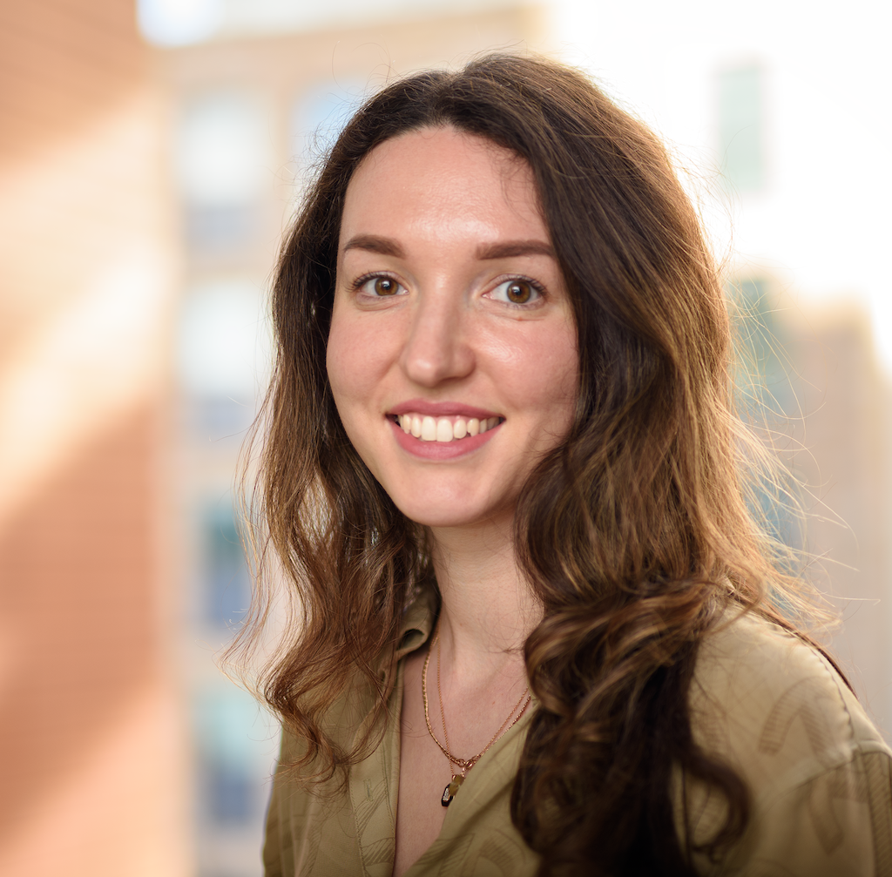

I am currently an Executive Director at Capital Fund Management (CFM), where I work on finding new sources of alpha using machine-learning techniques.

Trading is a particularly interesting domain for machine learning: datasets are large and non-stationary; the signal is weak and changes in response to our own actions and those of others; and there is no single correct training target (should we optimise over milliseconds, minutes, or weeks?). I'm currently very interested to find a robust, reliable, and efficient solution in this domain.

## Before
- I was an Assistant Professor in Mathematics and Machine Learning at Imperial College London, where I led a group studying the mechanisms underlying machine learning. I still hold an Honorary Lecturer position there. Alongside our core work, we occasionally ventured into neuroscience and questions about the human mind—topics I hope to return to one day.
- I was a senior machine learning scientist at Liquid AI [USD250mln raise](https://www.liquid.ai/blog/we-raised-250m-to-scale-capable-and-efficient-general-purpose-ai)
- I co-founded Skialabs, where we built software that manages waste collection operations in cities across the Netherlands, including Amsterdam. Funded by the European Union.
- I did a lot of consulting to hedge funds, Fortune 500 companies and startups. 

## Blog 

For reflections on machine learning visit my [Substack](http://ana15.substack.com).

## Youtube 

Check my [YouTube channel](https://www.youtube.com/@anastasiaborovykh120) for deepdives and tutorials. 

## Signal & noise meetup

We also organise the [Signal & Noise](https://luma.com/ik01xawq) machine learning meetup in Paris featuring ML talks from researchers & practitioners around Europe under the enjoyment of good snacks and natural wines. 

## Publications

See [Google Scholar](https://scholar.google.com/citations?user=6y1FmgQAAAAJ&hl=en&oi=ao) for a full overview of my research publications. A few recent ones I am excited about: 

##### [When Does Continual Learning Require Learning?](https://arxiv.org/abs/2607.07847) 
AI today is largely centralised: a small number of large models are trained and then delivered to users as mostly frozen systems. I am interested in bringing intelligence closer to where knowledge lives and allowing models to keep learning and adjusting to new inputs. In this work, we investigated several approaches to continual learning under different kinds of task and knowledge change. The main conclusion was that no single method works universally well. Different conditions require different update mechanisms, leaving substantial room to develop better continual-learning recipes. 

##### [Diffusion Models Preferentially Memorize Prototypical Examples—or: Why Does My Diffusion Model Love Slop?](https://arxiv.org/abs/2605.30642) 
Much has been written about models memorising unusual examples and outliers. At the same time, generative models often repeat common structures and stylistic patterns, such as the em dash. In this work, we studied these memorisation dynamics more closely. We found that common features are memorised earlier than atypical ones, and identified an intermediate stage of training in which data containing these common features is disproportionately generated. This may help explain why models can produce repetitive, stereotyped outputs before memorising complete training examples. 

##### [A Low-Variance Subspace Underlies Individual Differences in Resting-State fMRI](https://www.biorxiv.org/content/10.64898/2026.01.25.701594v1) 
This project was one of those mentioned stints into neuroscience. We identified a low-dimensional linear subspace of resting-state fMRI activity whose dimensions are highly reliable across repeated measurements. We then showed that these dimensions capture stable individual differences, effectively forming personal neural fingerprints. 

##### [Generalization in LLM Problem Solving: The Case of the Shortest Path](https://arxiv.org/abs/2604.15306) 
We used paths through graphs as a controlled, easy-to-study language for investigating generalisation in language-model problem solving. In particular, we separated two forms of generalisation: spatial transfer to previously unseen maps and length scaling to problems requiring longer solution paths. This setting allowed us to examine more precisely where models learn transferable problem-solving rules and where their performance breaks down as the reasoning horizon grows.

## Get in touch

* Email: a.surname@imperial.ac.uk

To ensure I read your message, include 'Building better ML' in the subject line.

## Links

1. [YouTube](https://www.youtube.com/@anastasiaborovykh120)
2. [Google Scholar](https://scholar.google.com/citations?user=6y1FmgQAAAAJ&hl=en&oi=ao)
3. [LinkedIn](https://www.linkedin.com/in/anastasia-borovykh-10380584/)
4. [Substack](http://ana15.substack.com)
5. [Slow Science](http://slow-science.org/) The way science should be done. 

<small>Over the years I've met the most amazing people and I'm grateful to all the conversations, collaborations and friendships along the way. A special thank you to [Cornelis Oosterlee](https://www.uu.nl/staff/CWOosterlee) for introducing me to the idea of pursuing a PhD, [Andrea Pascucci](https://www.unibo.it/sitoweb/andrea.pascucci) for supervising my PhD, [Greg Pavliotis](https://profiles.imperial.ac.uk/g.pavliotis) for being my mentor and supporting me at Imperial College London, [Reza Shokri](https://www.comp.nus.edu.sg/~reza/) for being a fantastic collaborator, and [Jean-Philippe Bouchaud](https://fr.wikipedia.org/wiki/Jean-Philippe_Bouchaud) for giving me the opportunity to join CFM.</small>
